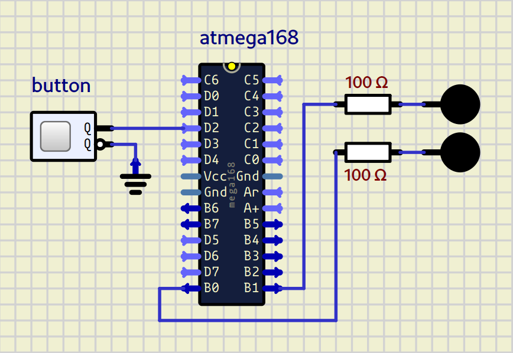

# AVR External Interrupt LED Control

This project demonstrates the use of an external interrupt (INT0) on an AVR microcontroller (e.g., ATmega328P) to control an LED based on a button state, while a second LED toggles continuously in the main loop. The interrupt is triggered on **any logic change** of the button pin, making the response immediate without polling.

## Table of Contents
- [Features](#features)
- [Hardware Requirements](#hardware-requirements)
- [Pin Mapping](#pin-mapping)
- [Software Requirements](#software-requirements)
- [Project Structure](#project-structure)
- [Building and Flashing](#building-and-flashing)
- [Operation](#operation)
- [Code Explanation](#code-explanation)
- [Simulation](#simulation)
- [License](#license)

## Features
- Non‑blocking button reading using **external interrupt INT0**.
- Immediate response to button press/release.
- Two independent LEDs:
  - **LED0** toggles every 200 ms (main loop).
  - **LED1** follows the button state (on when button is **not pressed**, off when pressed).
- Built with standard AVR‑GCC and a `Makefile`.

## Hardware Requirements
- Any AVR microcontroller with INT0 support (e.g., ATmega328P, ATmega8).
- Two LEDs with current‑limiting resistors (220–330 Ω).
- One push button.
- Pull‑up resistor (internal pull‑up is used, so no external resistor needed).
- Breadboard and jumper wires.
- ISP programmer (e.g., USBasp, Arduino as ISP) for flashing.

## Pin Mapping
| Component | AVR Pin            | Register / Bit          |
|-----------|--------------------|-------------------------|
| LED0      | Any pin of PORTB    | `LED0` (defined in `pinDefines.h`) |
| LED1      | Any pin of PORTB    | `LED1` (defined in `pinDefines.h`) |
| Button    | PD2 (INT0)          | `BUTTON` (defined in `pinDefines.h`) |

> **Note:** The actual pin assignments are defined in `src/includes/pinDefines.h`. Adjust the file to match your wiring.

The internal pull‑up of PD2 is enabled, so connect the button between PD2 and GND. When the button is pressed, PD2 reads `0`; when released, it reads `1`.

## Schematics

---

## Software Requirements
- `avr-gcc` (toolchain)
- `avr-libc`
- `make`
- `avrdude` (for flashing)

On Debian/Ubuntu, install with:
```bash
sudo apt install gcc-avr avr-libc avrdude make
```

## Project Structure
```
.
├── Interrupt.png           # Schematic or oscilloscope capture (not required for build)
├── Makefile                # Build automation
└── src/
    ├── main.c              # Main program with ISR and setup
    └── includes/
        ├── CPU.h           # CPU‑specific definitions
        └── pinDefines.h    # Pin mappings (LED0, LED1, BUTTON, etc.)
```

## Building and Flashing
1. **Edit the configuration**  
   Open `src/includes/pinDefines.h` and set the correct pins for your board.  
   Make sure `F_CPU` is defined in `CPU.h` or in the Makefile (usually 16000000UL for 16 MHz).

2. **Build the firmware**  
   From the project root, run:
   ```bash
   make
   ```
   This produces `main.hex` and `main.elf` in the build directory (if not overridden).

3. **Flash to the microcontroller**  
   Connect your programmer and run:
   ```bash
   make flash
   ```
   You may need to adjust the programmer type (`avrdude -c ...`) in the Makefile.

4. **Clean** (optional)
   ```bash
   make clean
   ```

## Operation
After flashing and powering the circuit:
- **LED0** blinks with a period of 400 ms (200 ms on, 200 ms off).  
- **LED1** is **on** when the button is **released** (pull‑up high).  
- **LED1** turns **off** when the button is **pressed** (pin pulled low).

The button reading is performed inside the `INT0` interrupt service routine, which runs on **any change** of the PD2 pin. Therefore the LED1 state updates immediately, without waiting for the main loop.

## Code Explanation

### Interrupt Service Routine (ISR)
```c
ISR(INT0_vect) {
    if ((BUTTON_PIN & (1 << BUTTON)))
        LED_PORT |= (1 << LED1);
    else
        LED_PORT &= ~(1 << LED1);
}
```
When a change on INT0 occurs, this ISR checks the current button level.  
- If the pin is high (button released) → turn **on** LED1.  
- If the pin is low (button pressed) → turn **off** LED1.

### Initialisation (`initInterrupt0`)
- Enable INT0 in `EIMSK`.
- Set `ISC00` in `EICRA` to trigger on **any logical change**.
- Enable global interrupts with `sei()`.

### Main Loop
```c
while (1) {
    _delay_ms(200);
    LED_PORT ^= (1 << LED0);
}
```
Simply toggles LED0 every 200 ms. The interrupt runs asynchronously, so LED1 responds independently.

### Setup
- All pins of the LED port are set as outputs (`LED_DDR = 0xff`).
- The button port (PORTD) is set to inputs (`DDRD = 0x00`) and the internal pull‑up is activated for the button pin.
- The interrupt is then initialised.

## License
This project is open‑source and provided under the **MIT License**. Feel free to use, modify, and distribute it for educational or commercial purposes.